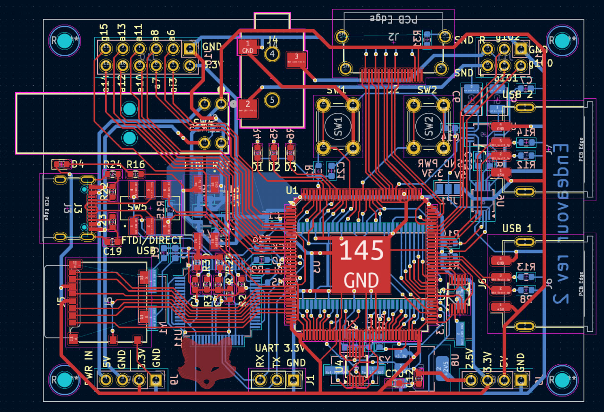
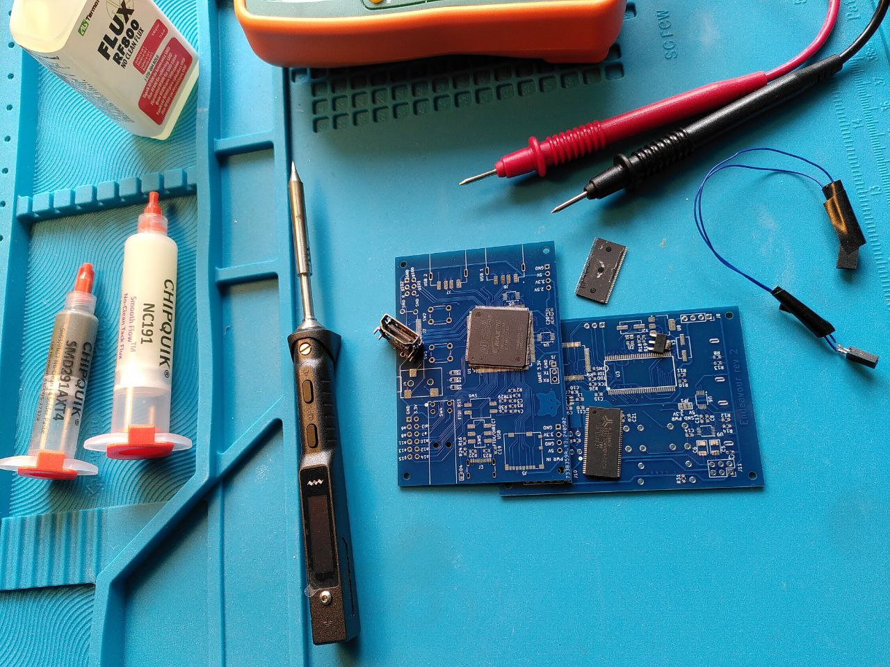
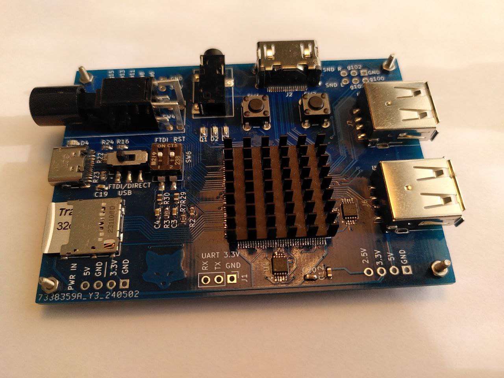
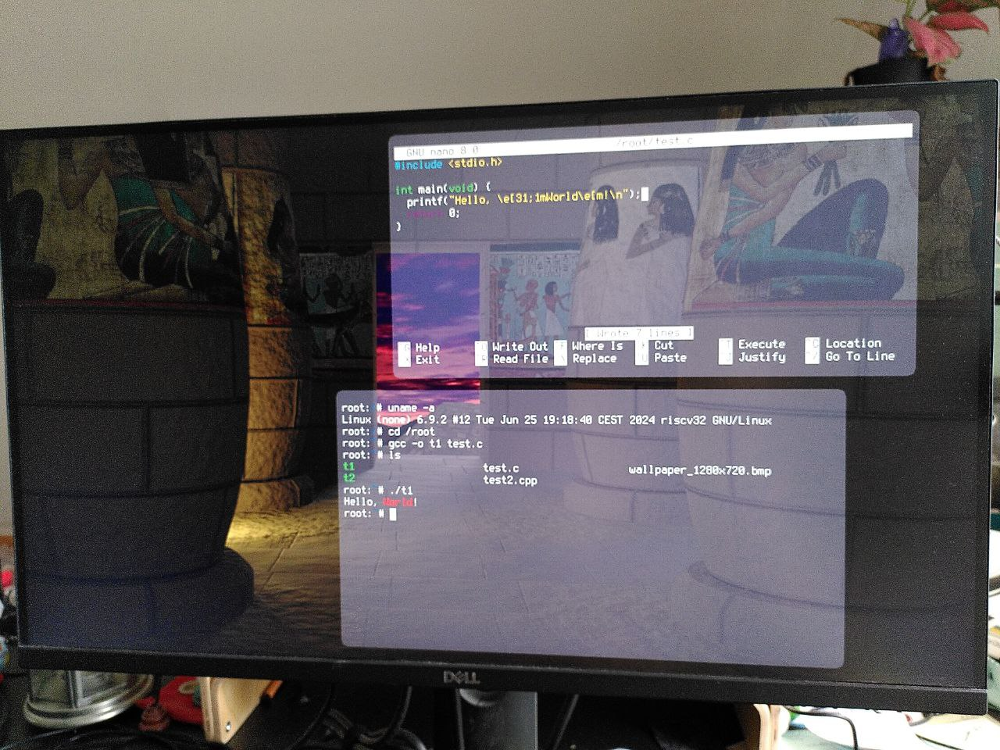
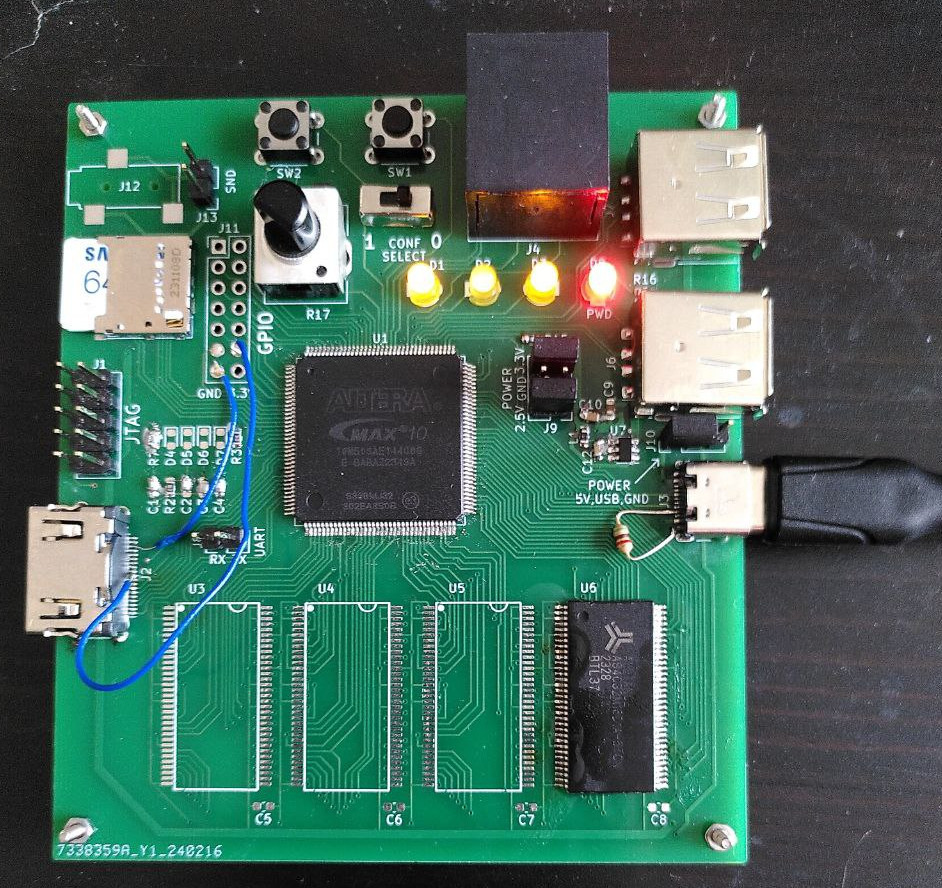
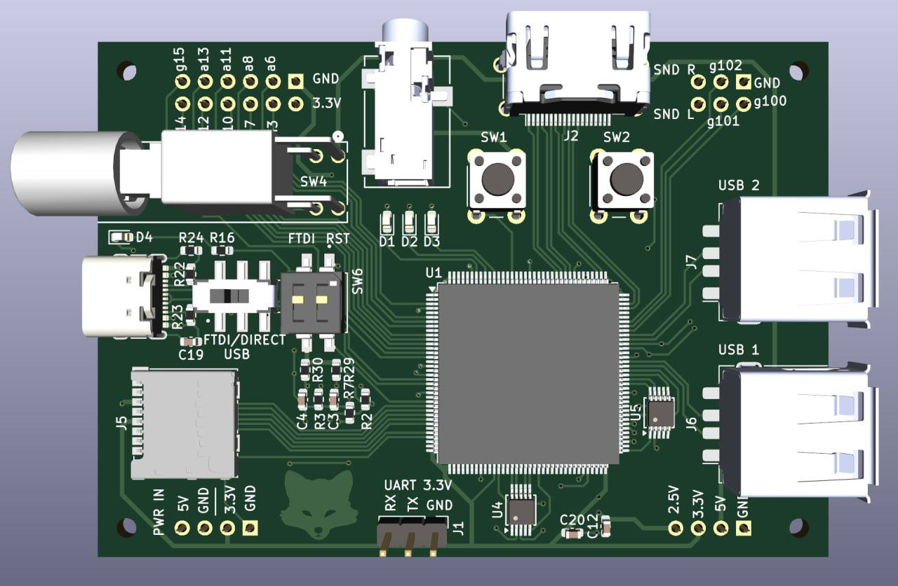
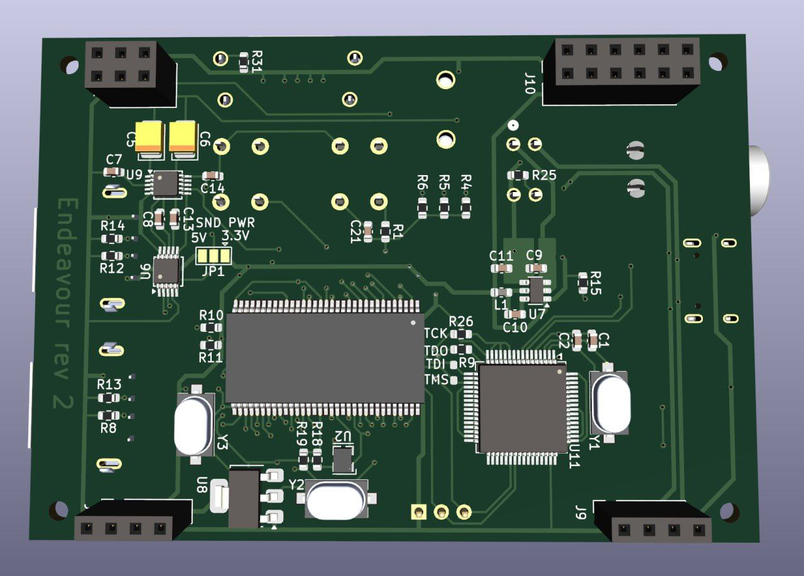
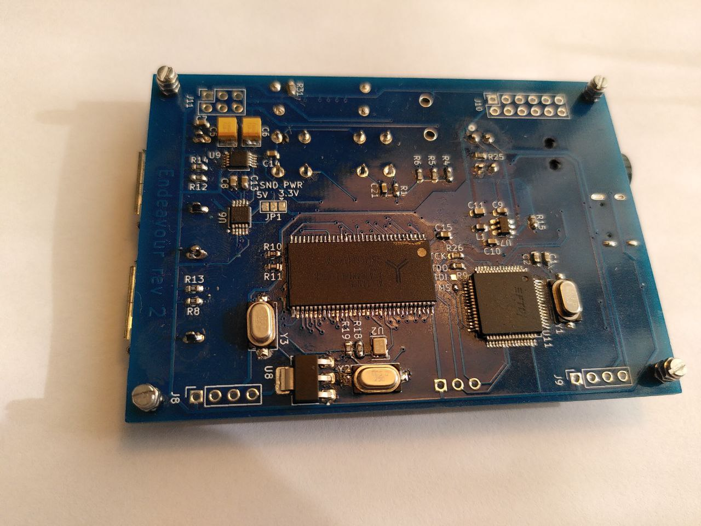

Endeavour - open-source FPGA board and SoC
==========================================

| | |
|:-------------------------:|:-------------------------:|
|  |  |
|  |  |

### Project goal

- Design my own FPGA board and make a computer based on it.
- "A computer" means being able to attach a display and keyboard, and write and compile software directly on the device.
- Try to achieve best possible performance using only the components I can solder. In other words: no BGA chips.

What are the practical uses of the device? No practical use. It is a hobby project, I just wanted to do it.

### Results

- It works!
- It runs linux.
- Until now the main focus was to make it work and currently performance is far from theoretical limits. Compiling hello world takes almost 10 seconds. It can be [improved](#future-plans).

## Hardware

### Components

**FPGA**

Due to the "I can't solder BGA" limitation there wasn't much choice.

I use 10M50SAE144, Intel MAX10 series, as currently (2024) it is by a huge margin the biggest (50K logic cells) non-BGA FPGA chip and also over all alternatives has the largest number of available IO pins.

- 10M50SAE144, EQFP-144
- 50K logic cells
- 182 M9K blocks
- 101 IO pin
- 1 PLL

**RAM**

Seems all RAM starting from DDR2 are BGA-only. I chose the biggest available DDR1 chip:

- AS4C64M16D1, TSOP66
- DDR1 128MB
- Max frequency 166Mhz
- CL 2 (up to 133Mhz) or 2.5 (up to 166Mhz)
- 16 data pins
- Max theoretical throughput: 664 MB/s

There is an option to use a smaller compatible chip. E.g. AS4C32M16D1 (64MB).

**Other chips**

- USB to UART/JTAG converter: FT2232HL
- 48Mhz clock generator, 2x external PLL Si5351A
- audio: D2A converter MCP4728, amplifier LM4811
- dc-dc converters: AP63203WU (5V -> 3.3V), AP2114H (3.3V -> 2.5V)

### Interfaces

Main interfaces

- USB-C: power / JTAG / UART / USB1.1 device
- Micro SD card slot
- DVI-D with HDMI connector
- 2x USB-A: USB1.1 host
- 3.5mm stereo audio

LEDs and buttons

- power button
- power LED
- FTDI power switch
- USB-C data lines switch "to FTDI" / "direct connection to FPGA"
- 3 LEDs
- 2 push buttons
- 1 switch (used as CPU reset)

For future extensions

- 3 GPIO pins
- 9 configurable GPIO/analog input pins
- 1 dedicated analog input pin

### Revision 1

  
First attempt wasn't fully successful (though as expected). Keeping it here for history.

Results:

- practiced soldering;
- tested powering scheme, tested flashing via JTAG over FT2232HL;
- tested UART and SD card controllers;
- found some problems in the scheme, e.g. found out that USB-C requires 5.1K resistors to get power from the cable.
- DVI-D interface didn't work, mostly due to soldering errors;
- tried scheme with 4 AS4C32M16D1 DDR1 (4*64=256MB RAM in total) on a single bus, but even a single chip didn't work properly.
  Either because FPGA IO delays were configured incorrectly, or because tracks on PCB were too long.
  I decided to simplify the scheme: in second revision there is only a single 128MB DDR1 chip placed right under the FPGA in order to minimize tracks length and tracks length inequality.

[KiCad project](hardware/rev1), [gerber files](hardware/rev1/export)

  

### Revision 2

[KiCad project](hardware/rev2), [gerber files](hardware/rev2/export)

  
images

  
  

  
  

## RTL

TODO

## Software

TODO

## Future plans

TODO
